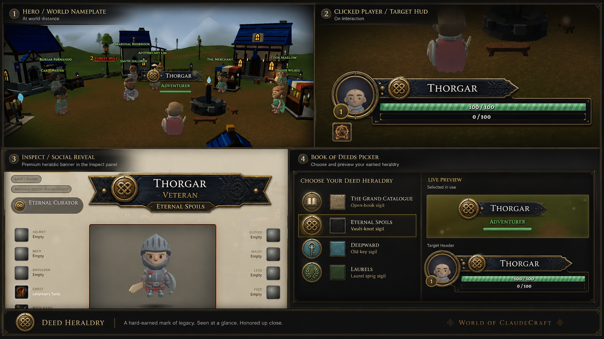

# Deed Heraldry: approved art direction

Status: approved on 2026-08-18 after the Phase 4 visual review and refined on
2026-08-23 after the `release/v0.40.0` integration.

This document supersedes the Phase 1-4 cartouche as the visual acceptance
target. It does not erase that work: the saved-state path, palette lookup,
fairness rules, pure geometry seam, screenshot recipes, and tests are useful
chassis. Phases 5-8 transform that chassis into Deed Heraldry.



The image is a direction reference, not a pixel specification. Its hierarchy,
material language, and relationship between surfaces are approved. Incidental
mockup text is illustrative. Shipping copy must come from the live deed catalog
and `t()` keys. Do not add the mockup's descriptive labels as new deeds, slugs,
titles, or lore.

The post-v0.40 craft pass resolves the reference as a plaque, not a rounded
ribbon. The world form is a shallow fixed-pixel point and notch joined to the
existing round seal. Interaction surfaces expand the same silhouette across
the name-header column, and inspect uses its largest ceremonial form. The
shared geometry stays code-native and the four reward identities still come
only from their existing seal motifs and palettes.

The final ceremonial refinement keeps that family but gives each scale the
hardware it needs. Compact and mirrored gameplay plaques retain their shallow
8px point and 4px notch. Inspect uses a dark 60px forged face with 16px
shoulders, a keyed 64px medallion, and a quiet 18px provenance tab with 10px
shoulders. The larger values are fixed hardware measurements, not proportions
that stretch with localized copy.

## Decision

The reward is no longer a border treatment. It is a two-scale identity system:

1. **Seen at a glance.** In the world, a small forged deed seal sits beside the
   player's name on a quiet midnight plaque. This is the recognition token.
2. **Honored up close.** On the player/target frame and inspect card, the same
   seal, metal, and restrained heraldic pattern expand into a richer social
   reveal. This is the reward moment.

The internal reward kind, persisted `activeBorder`, `deed_set_border` command,
and the four existing slugs may keep their names. "Deed Heraldry" is the visual
system and may become the player-facing picker heading if the implementation
adds the required localized copy.

## Why this is the right MMORPG reward

Strong prestige systems use more than one scale:

- RuneScape makes accomplishment a worn silhouette and gives it a special
  emote: https://oldschool.runescape.wiki/w/Cape_of_Accomplishment
- World of Warcraft describes class mounts as status symbols and layers hard
  rewards across titles, mounts, armor, tabards, and customization:
  https://worldofwarcraft.blizzard.com/en-us/news/20836730/class-mounts-take-pride-in-every-step
- Call of Duty pairs a compact prestige icon with skins, calling cards,
  mastery badges, and a richer profile showcase:
  https://www.callofduty.com/uk/en/blog/2024/10/call-of-duty-black-ops-6-launch-progression-leveling-prestiging-challenges-intel
- Final Fantasy XIV lets earned identity open up on Adventurer Plates through
  backgrounds, pattern overlays, frames, and portraits:
  https://na.finalfantasyxiv.com/lodestone/topics/detail/6eee1ca8a733856669d901d95d2fa9db46a466e6/
- Diablo IV uses named Seals as proof of mastery, backed by mount trophies and
  permanent leaderboard recognition:
  https://news.blizzard.com/en-us/article/24062308/undying-glory-awaits-in-trials

The shared lesson is the contract here: a rare reward needs a compact token at
world distance and a richer reveal on a social surface. A full nameplate border
is too much chrome for the first job and too little identity for the second.

## Surface contract

### World nameplate: recognition token

- A 16-18 CSS-pixel forged seal sits immediately left of the centered name
  group. It overlaps or keys into the plaque like real attached hardware.
- The existing motif is the seal face. It must be readable by silhouette at
  normal nameplate distance, not only in a zoomed crop.
- A shallow blue-black pointed plaque sits behind the name row only. It may have a
  restrained leather or woven grain and one fine antique-metal structural
  edge. It is not a full perimeter frame.
- The chosen title returns to its existing secondary text line outside the
  ribbon. Guild, health, cast, combo, raid mark, quest marker, emote, and all
  other actionable or semantic slots remain outside and unchanged.
- The name remains the hero. The seal should invite recognition, not compete
  with reading the player.
- The shared `#14110c` well near 0.4 alpha remains the starting material. The
  Phase 5 screenshot pass may tune dimensions and alpha if normal-distance
  evidence requires it. The old 9/5 pad, radius 6, and extraLift 14 are
  implementation history, not locked acceptance values for the new plaque.

### Player and target HUD: interaction reveal

- Keep the portrait circular. Use a fine family metal edge, never a decorated
  square around the portrait.
- Put the seal at the visual joint between portrait and name header. Remove the
  current 12-o'clock hollow clasp if it still reads as a checkbox or bug.
- Apply a quiet, motif-derived pattern only to the name header. Do not reskin
  the entire unit frame.
- HP, resource, absorb, cast, elite, combat flash, level, title, sanction, and
  target-of-target semantics stay in their existing hierarchy and colors.
- The player frame gives the owner a persistent self-view. The target frame
  gives other players the richer reveal when they click the wearer.

### Inspect: ceremonial reveal

- Use the largest treatment in the family: a 580x72px ceremonial host with a
  dark 60px forged face, fine inset edge, and low-contrast pattern derived from
  the existing motif.
- Key the 64px seal into the face through a short blackened collar. It is
  attached hardware, not an icon floating in a grid cell.
- Keep the real player name and equipped title centered in the face. Put the
  localized granting-deed name in the attached 18px provenance tab rather than
  compressing it into a third identity line. Do not invent a new reward name.
- The banner must support the paperdoll rather than dominate it. Equipment,
  standing, badges, and stats remain the content hierarchy. Existing honors
  collect on one quiet rail rather than becoming independent dashboard cards.
- Parchment is the acid test. Antique brass must remain visible without turning
  into saturated yellow or thick chrome.

### Book of Deeds picker: desire and confidence

- Reuse `.deed-title-option`, its focus rules, and the 40x40 mobile touch floor.
- Each earned option shows the actual seal plus a small material sample and the
  existing deed name. Do not reduce identity to anonymous color stripes.
- The interaction preview uses a dark, metal-keyed portrait cameo. It may stay
  abstract, but must not read as an empty white placeholder on Parchment.
- None stays visibly empty and never impersonates an earned material.
- The selected option drives a live preview of the world token and the richer
  target/inspect treatment. A player should know exactly what enabling it does.
- Desktop, mobile, classic, midnight, parchment, and high-contrast themes must
  all preserve hierarchy and selection clarity.

## One family, four identities

Only the existing four slugs and motifs ship:

| Slug | Motif | Material read |
|---|---|---|
| `curators_gilt` | catalogue / open book | Muted antique brass and ivory. Keep `#c9b17a` / `#2a2214` / `#f3ebcf`. |
| `reliquary_gilt` | interlocked vault knot | Capstone aged gold. Keep it distinct from Catalogue, quest, and elite gold. |
| `deepward` | old ward key | Cyan-patina silver and dark teal. |
| `prestige_laurels` | laurel sprig | Green bronze and pale verdigris. |

Each identity uses three redundant signals: color, seal silhouette, and a
low-contrast pattern derived from that same motif. The pattern may repeat or
enlarge the existing mark, but it must not introduce a fifth symbol or a new
family restyle.

## Beauty and rejection tests

The work is not visually complete unless all are true:

1. At normal nameplate distance, the seal reads before the metal color and the
   name reads before both.
2. In a grayscale or color-ambiguous crop, all four seals remain distinguishable.
3. The world token, player frame, target frame, inspect banner, and picker look
   like the same crafted object at different scales.
4. Borderless remains clean and screenshot-identical in spirit.
5. Nothing resembles a yellow bar, generic rounded badge, full HUD outline,
   hollow checkbox, pause icon, or mobile-app pill.
6. No motif noise crosses the letters or fights the name.
7. No gold wraps health, resource, cast, guild, markers, or other gameplay data.
8. Low graphics still shows the complete identity. Only restrained bloom may
   shed. There is no sparkle or continuous animation.
9. A player seeing it in town should want to click the wearer; the click and
   inspect reveal must reward that curiosity.

## Performance contract

- The world nameplate stays shape-based and allocation-free per plate per frame.
  Use cached/static motif primitives and caller-owned geometry. No generated
  concept bitmap ships as runtime UI.
- The hot path adds no image decode, DOM read, canvas gradient allocation, blur,
  filter, or animation. A solid well, fine strokes, and cached primitives are
  enough.
- Player/target painters continue through elided DOM writers. Richer inspect and
  picker work is cold-path or event-driven.
- No graphics tier, governor, or effects-profile input may hide the seal,
  plaque, pattern, or structural edge. Only the existing bloom path may scale.
- The selective gate, painter budget, monolith budget, and focused allocation
  pins must stay green.

## Existing screenshots that explain the pivot

- `phase-03/nameplate-vault-town-desktop.png`: the rectangle reads before the
  reward identity at play distance.
- `phase-03/nameplate-catalogue-vs-spoils-desktop.png`: color differs, but the
  silhouette does not communicate the deed strongly enough.
- `phase-03/inspect-mobile.png`: enlarging the outline produces a generic slab,
  not a richer reward reveal.
- `phase-03/portrait-ring-high-desktop.png`: the clasp can read as a hollow
  checkbox.
- `phase-03/picker-flip-catalogue-desktop.png`: the three-color swatch reads as
  anonymous stripes rather than earned identity.

## Image-generation provenance

The approved direction image was generated in the built-in imagegen mode from
the Phase 3 world, target, inspect, and picker screenshots. It is stored at
`docs/screenshots/deed-border-cartouche/direction/deed-heraldry-concept.png`.

Final prompt:

```text
Use case: ui-mockup
Asset type: polished 16:9 UI concept mockup sheet for the indie fantasy MMORPG World of ClaudeCraft
Input images: Phase 3 nameplate, target frame, inspect, and Book of Deeds picker screenshots as visual and layout references
Primary request: replace the full rectangular nameplate border with a two-scale Deed Heraldry identity system: a compact forged deed seal plus quiet midnight-ink name ribbon at world distance, expanding into a rich heraldic target header and inspect banner on interaction
Composition/framing: four coherent examples on one sheet: hero world nameplate, clicked-player target HUD, inspect/social reveal, and Book of Deeds picker with live previews
Style/medium: premium crafted fantasy MMORPG UI; pixel-sharp, production-ready, weathered and tactile rather than concept-art loose
Color palette: blue-black ink, blackened iron, parchment, restrained antique metals; Catalogue muted brass, Eternal Spoils aged gold, Deepward cyan-patina silver, Laurels green bronze
Materials/textures: dyed leather or woven cloth, subtle blind embossing, fine hand tooling, tiny believable rivets, hairline metal edges
Text (verbatim): "THORGAR", "VETERAN", "ETERNAL SPOILS"
Constraints: the world name remains the hero; use only the four existing catalogue, vault, ward, and laurel motifs; keep the circular portrait; keep health, resource, cast, guild, and markers ordinary and outside the reward treatment; color plus seal plus material pattern provide redundant identity; identity remains legible at small sizes
Avoid: thick yellow bars, thick gold fills, glowing chrome, sparkle, neon, generic rounded mobile pills, new silhouettes, giant crests, full nameplate perimeter outlines, wrapping or recoloring gameplay bars, checkbox-like clasps, brand logos, watermarks, or UI copied from another game
```
