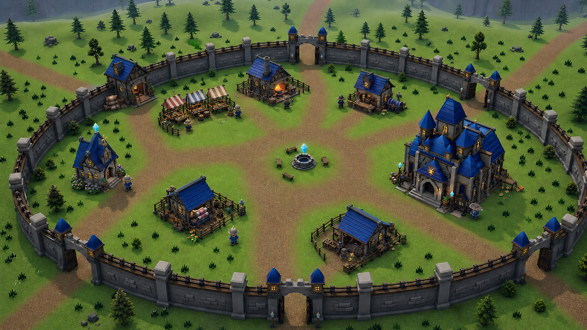

# Eastbrook Vale rebuild: measured site plan

Status: superseded planning baseline (rebuild v1). This document separates authored facts
and computed measurements from visual interpretation, and it remains the record of how the
v1 lots were derived. The polish-v2 finishing pass then moved the Smithy, Chapel, Weaving
workshop, and Toolworks outward, made the market distributed, and repositioned several
NPCs, so DO NOT copy coordinates from this file: the shipped literals are owned by
`final-report.md` and pinned by the layout tests.



## Evidence classes

- **Authored fact** comes from the current data records in
  [`ZONE1_PROPS`](../../../src/sim/content/zone1.ts),
  [`ZONE1_NPCS`](../../../src/sim/content/zone1.ts),
  [`STATIONS`](../../../src/sim/content/professions.ts), and
  [`MAILBOXES`](../../../src/sim/content/mailboxes.ts), or from the accepted numeric layout
  contract below.
- **Computed fact** is obtained from those literals with the formulas in this document. The
  values are reproducible and do not depend on a screenshot judgment.
- **Design inference** is a visual decision taken from the accepted concept or turnarounds. It
  may guide modeling, but it does not override authored coordinates, collision, interaction,
  or path clearance.
- **Authoritative layout literal** is an accepted coordinate, facing, order, or classification
  that implementation and tests must copy exactly.

World distances are yards. Positions are `(x, z)`. Rotations are Three.js yaw in radians, with
local `+Z` as the front axis. The shared transform in
[`buildingLocalToWorld`](../../../src/sim/building_layout.ts) is:

```text
worldX = centerX + localX * cos(yaw) + localZ * sin(yaw)
worldZ = centerZ - localX * sin(yaw) + localZ * cos(yaw)
```

Except for the preserved Armoury, each proposed service front points at the civic-center axis
`(0, 2)`:

```text
yaw = atan2(0 - centerX, 2 - centerZ)
```

## Current authored inventory

This section is the replacement baseline, not a list of compatibility coordinates. Town
coordinates may move. IDs, source order, roles, quest and vendor payloads, and behavior flags
must not change as a side effect of the rebuild.

### Shared render and collision props

The following values are the town subset of `ZONE1_PROPS`, in exact array order. Buildings use
oriented bounding boxes. Wells and stalls use the authored radius in simulation collision.

| Array index | Current authored record | Disposition |
|---:|---|---|
| building 0 | `house(10, 12, 7, 6, -0.4)` | Replace with a named service building. |
| building 1 | `house(-10, 10, 6, 5, 0.5)` | Replace with a named service building. |
| building 2 | `inn` tagged `eastbrook_grand_armoury`, lot `(17.5, -5.5)`, `13 x 9`, yaw `-pi/2` | Preserve its lot, landmark tag, model, `15` yard above-grade height, and `1.35` yard foundation depth. Change only its gameplay kind from `inn` to `house`; the Armoury must no longer grant rest. |
| building 3 | `chapel(-16, -8, 5, 7, 0.9)` | Replace with the new chapel asset and lot. |
| well 0 | `(0, 2)`, radius `1.5` | Replace with the new civic feature at `(-0.75, 2)` while preserving the radius. The small westward offset opens the player-start lane. |
| stall 0 | `(-8.5, 3)`, yaw `pi/2`, radius `1.7` | Remove and replace in the radial market row. |
| stall 1 | `(9.5, 17.5)`, yaw `-2.7`, radius `1.7`, `smithy: true` | Remove and replace in the radial market row. |
| stall 2 | `(0, 11.5)`, yaw `pi`, radius `1.8` | Remove and replace in the radial market row. |
| campfire 0 | `(3, -4)`, collision radius `0.85` | Remove from town. The kitchens station remains the owner of a live cooking fire. |
| fence 0 | `(16, 16)` to `(22, 4)` | Remove. |
| fence 1 | `(-16, 14)` to `(-20, 2)` | Remove. |

The current renderer chooses the two generic house visuals, composes the old chapel, selects
stall variants by array index, and builds the well, town fire, and fence modules in
[`buildProps`](../../../src/render/props.ts). The Grand Armoury is already dispatched through
[`buildEastbrookGrandArmouryView`](../../../src/render/eastbrook_grand_armoury.ts). The rebuild
must keep simulation and renderer placement on one authored record rather than creating a
second render-only town layout.

### Exterior zone arrays that are out of scope

These values and their order are preservation pins. Removing the town campfire must remove only
the first `campfires` row. No exterior item may move or be reordered.

| Array | Exact preserved rows, in order |
|---|---|
| `mines` | `(-88, -68, yaw 0.8)` |
| `docks` | `(-64, 60, yaw -2.2)`, hut local `(2.8, 2.4, half-width 1.7, half-depth 1.5)` |
| `tents` | `(62, -61, 0.4, scale 1)`, `(69, -69, 2.1, scale 1)`, `(88, -86, 1.2, scale 1.3)`, `(95, -94, -0.6, scale 1)` |
| `crates` | `(60, -63)`, `(66, -67)`, `(87, -88)`, `(93, -90)`, `(70, -72)` |
| `campfires` after town removal | `(65, -65)`, `(90, -90)`, `(-80, -60)`, `(-61, 56)` |
| `mudHuts` | `(-73, 59)`, `(-78, 54)`, `(-69, 55)` |
| `ruinRings` | `(80, 78, radius 7, columns 7)`, `(-5, -60, radius 8, columns 6)` |
| `graveyards` | `(-14, -14)`, `(4, -56)` |
| `delveMarkers` | `(-5, -52, collapsed_reliquary)` |

The six `ZONE1_ROADS` polylines retain their source order and all exterior waypoints:

1. Wolf: `(0, 8) -> (-8, 30) -> (-15, 55) -> (-2, 78)`.
2. Boar: `(8, 2) -> (30, 8) -> (55, 12)`.
3. Bandit: `(6, -6) -> (30, -30) -> (50, -50) -> (65, -65)`.
4. Mirror: `(-8, 6) -> (-35, 25) -> (-58, 48) -> (-66, 58)`.
5. Copper: `(-6, -6) -> (-30, -28) -> (-55, -45) -> (-70, -55)`.
6. Fallen: `(6, 8) -> (35, 35) -> (60, 60) -> (78, 74)`.

The authoritative town-side lanes extend from the civic ring, through each existing first road
point, to the matching wall crossing. Each has `halfWidth: 1.5`. The lane rows retain the same
semantic order as the six exterior routes above; exterior waypoints remain preserved.

| Source route | Layout road ID | Exact civic-to-gate and road-through-gate points, in order |
|---|---|---|
| Wolf | `north` | `(0, 6.75) -> (0, 8) -> (-7.190451611555966, 27.474668435158083) -> (-7.469, 28.539)` |
| Boar | `east` | `(4.75, 2) -> (8, 2) -> (15, 3.5) -> (23, 4.5) -> (27.443132443127425, 7.309889308940804) -> (28.506, 7.593)` |
| Bandit | `bandit` | `(2.85, -1.8000000000000003) -> (6, -6) -> (8, -12) -> (20.08183258569795, -20.08183258569795) -> (20.86, -20.86)` |
| Mirror | `northwest` | `(-4.2485291572496005, 4.124264578624801) -> (-8, 6) -> (-15, 8) -> (-21, 11) -> (-23.056701749697417, 16.58157122909346) -> (-23.95, 17.224)` |
| Copper | `southwest` | `(-2.85, -1.8000000000000003) -> (-6, -6) -> (-10, -8) -> (-20, -9) -> (-22, -12) -> (-17.851916681798443, -16.779722011586674) -> (-20.69365035767656, -19.45077980118619) -> (-21.495, -20.204)` |
| Fallen | `northeast` | `(3.3587572106361003, 5.358757210636101) -> (6, 8) -> (12, 14) -> (19.58928369573657, 20.562586517458097) -> (20.348, 21.359)` |

The first point of every row lies on the civic ring at radius `4.75`; the second point is the
existing town-side `ZONE1_ROADS` point. The penultimate point is the exact gate-center projection
on the `28.4` yard wall centerline, and the last point is the preserved approximately `29.5` yard
road-through-gate point outside the solid wall. The Bandit row's `(8, -12)` bend is intentional.
The Southwest row's `(-22, -12)` and radial-alignment point
`(-17.851916681798443, -16.779722011586674)` are required to take the full three-yard lane
through the exact gate without grazing the wall. Do not derive smoother substitutes from the
concept image.

### Renderer-only Artisan Row

[`ARTISAN_ROW_PLACEMENTS`](../../../src/render/artisan_row_props.ts) is fully renderer-only and
is integrated directly by `Renderer`, not by `buildProps`. It has no collision, interaction, or
`IWorld` state. All ten current placements are removed by this rebuild:

| Order | Kind | Position | Yaw | Current target height |
|---:|---|---:|---:|---:|
| 1 | `engineering_workbench` | `(2, 20)` | `0.4` | `1.0` |
| 2 | `alchemy_cauldron` | `(5, 23)` | `-0.6` | `0.9` |
| 3 | `cooking_spit` | `(9, 25)` | `0` | `0.85` |
| 4 | `leatherworking_rack` | `(13, 24)` | `0.9` | `1.5` |
| 5 | `tailoring_loom` | `(13.5, 20.5)` | `1.6` | `1.3` |
| 6 | `inscription_lectern` | `(19.5, 14.5)` | `2.4` | `1.1` |
| 7 | `enchanting_altar` | `(16, 13)` | `-2.6` | `1.0` |
| 8 | `jewelcrafting_bench` | `(15, 9)` | `-1.8` | `0.9` |
| 9 | `mining_ore_cart` | `(3, 12)` | `-0.9` | `1.1` |
| 10 | `herbalism_drying_rack` | `(1, 16)` | `0.3` | `1.4` |

Removing these placements does not authorize deleting their GLBs if another consumer still uses
them.

### Gameplay stations and visual clusters

The Eastbrook station identities and source order are preserved. Each station and its
`masterNpcId` move as the exact coupled pair below. The shared interaction radius remains the
current `STATION_RADIUS` value.

| Order | Station | Type | Current position | Authoritative position | Master | Authoritative master position | Master facing |
|---:|---|---|---:|---:|---|---:|---:|
| 1 | `station_eastbrook_forge` | `forge` | `(7, 16.5)` | `(3.3817510253835374, 14.399753759739639)` | `forgemistress_darva` | `(1.4522233829080733, 14.925988571323856)` | `1.837048375945822` |
| 2 | `station_eastbrook_kitchens` | `kitchens` | `(-11, 4.5)` | `(-11.45529660468886, 11.459306117623747)` | `cook_marlow` | `(-12.780764037489869, 10.316661779002187)` | `0.8593372010553885` |
| 3 | `station_eastbrook_loom` | `loom` | `(-2, -8)` | `(-4.392935545995001, -12.217136857947459)` | `weaver_ottilie` | `(-2.4820752035669784, -12.807571233416791)` | `-1.2711134967878872` |
| 4 | `station_eastbrook_toolworks` | `toolworks` | `(11, -12)` | `(4.457282212971036, -13.397884008445395)` | `tinker_gizzel` | `(6.378410741800159, -12.84176785536328)` | `-1.8525681940682492` |

The two later `STATIONS` rows, `station_fenbridge_tannery` at `(-13, 314)` and
`station_highwatch_apothecary` at `(7, 660)`, remain byte-for-byte and order-stable.

[`STATION_PROP_CLUSTERS`](../../../src/render/stations_core.ts) remains the visual offset
contract. Offsets are relative to the relocated station anchor and retain this exact order:

| Type | Cluster offsets `(kind, dx, dz, yaw)` | Current absolute positions | Authoritative absolute positions |
|---|---|---|---|
| `forge` | `anvil, 0, 0, 0.9`; `barrel, -1.1, 1.0, 0.3`; `crate, 1.0, -1.2, -0.5` | `(7, 16.5)`, `(5.9, 17.5)`, `(8, 15.3)` | `(3.3817510253835374, 14.399753759739639)`, `(2.2817510253835374, 15.399753759739639)`, `(4.3817510253835374, 13.19975375973964)` |
| `kitchens` | `campfire, 0, 0, 0`; `crate, 1.2, 0.5, 0.7`; `barrel, -0.5, 1.4, -0.2` | `(-11, 4.5)`, `(-9.8, 5)`, `(-11.5, 5.9)` | `(-11.45529660468886, 11.459306117623747)`, `(-10.25529660468886, 11.959306117623747)`, `(-11.95529660468886, 12.859306117623747)` |
| `loom` | `loom, 0, 0, 0.6`; `crate, 1.3, 0.6, -0.3`; `barrel, 0.4, 1.5, 0.5` | `(-2, -8)`, `(-0.7, -7.4)`, `(-1.6, -6.5)` | `(-4.392935545995001, -12.217136857947459)`, `(-3.092935545995001, -11.61713685794746)`, `(-3.992935545995001, -10.717136857947459)` |
| `toolworks` | `workbench, 0, 0, -0.4`; `crate, -0.9, 0.4, 0.2`; `barrel, -1.0, 1.1, -0.8` | `(11, -12)`, `(10.1, -11.6)`, `(10, -10.9)` | `(4.457282212971036, -13.397884008445395)`, `(3.5572822129710358, -12.997884008445395)`, `(3.4572822129710357, -12.297884008445395)` |

The station anchor, not a decorative mesh, remains the gameplay proximity source. A building
asset may expose a named service socket, but it must not bake a second anvil, campfire, loom, or
workbench on top of the runtime cluster.

### Mailbox and NPC presence

The `MAILBOXES` source order is Eastbrook `(7, -8)`, Fenbridge `(6, 294)`, Highwatch `(6, 654)`.
Only the first row moves, to the authoritative coordinate `(0, -7.5)`. Mailbox spawning still
uses `findSafePos`, so verification records both the authored and resolved position. The exterior
rows remain unchanged.

The following table records `ZONE1_NPCS` source order, including the exterior dynamic NPC. Every
town placement has an exact authoritative position and facing. IDs, names, titles, colors, quest
arrays, vendor arrays, greetings, and role flags remain unchanged.

| Order | NPC ID | Current position / facing | Authoritative position / facing | Preserved role or flag |
|---:|---|---|---|---|
| 1 | `the_merchant` | `(0, 9.5)`, `pi` | `(-2.87967661431468, 6.20921163603936)`, `2.5415926535897935` | `market: true` |
| 2 | `marshal_redbrook` | `(4, 6)`, `pi` | `(4.5, 5.5)`, `-2.2318394956455836` | Town Marshal |
| 3 | `trader_wilkes` | `(-7, 3)`, `pi/2` | `(-4.026148437319036, 11.604172466208292)`, `-2.1707963267948966` | Provisioner vendor |
| 4 | `apothecary_lin` | `(11, -3)`, `-pi/2` | `(-5.83300435218315, 14.245246433919265)`, `-2.1707963267948966` | Herbalist quest giver, associated with the artisans stall |
| 5 | `brother_aldric` | `(-14, -10)`, `0.8` | `(-13.607158229172214, -1.0238129398160472)`, `1.3521273809209546` | Priest quest giver |
| 6 | `smith_haldren` | `(7, 16.5)`, `-2.7` | `(5.311278667859002, 13.873518948155422)`, `-1.3045442776439713` | Armorer and weaponsmith vendor |
| 7 | `fisherman_brandt` | `(-16, 6)`, `-0.75` | `(-22, 4)`, `1.661456213995642` | Fishing vendor and quest giver |
| 8 | `foreman_odell` | `(-4, -14)`, `-2.14` | `(-8, -9.5)`, `-2.289626326416521` | Mine and professions quest giver |
| 9 | `bursar_fernando` | `(13, 8)`, `-pi/2` | `(14.156943251329539, 8.685223202016726)`, `-2.0119758072098772` | `banker: true` |
| 10 | `card_master` | `(13, 2)`, `-pi/2` | `(10.5, 1)`, `-1.4758446204521403` | `cardMaster: true` |
| 11 | `groundskeeper_bram` | `(-6, -82)`, `pi` | `(-6, -82)`, `pi` | `dynamic: true`, exterior, unchanged |
| 12 | `chronicler_saul` | `(15, -16)`, `2.4` | `(18, -15)`, `-0.8139618212362083` | Chronicler |
| 13 | `forgemistress_darva` | `(5, 15)`, `-2.4` | `(1.4522233829080733, 14.925988571323856)`, `1.837048375945822` | Forge master |
| 14 | `cook_marlow` | `(-12.5, 3)`, `pi/2` | `(-12.780764037489869, 10.316661779002187)`, `0.8593372010553885` | Kitchens master |
| 15 | `weaver_ottilie` | `(-4, -9)`, `0.8` | `(-2.4820752035669784, -12.807571233416791)`, `-1.2711134967878872` | Loom master |
| 16 | `tinker_gizzel` | `(9.5, -14)`, `-0.8` | `(6.378410741800159, -12.84176785536328)`, `-1.8525681940682492` | Toolworks master |

At seed `20061`, current collision-safe spawning nudges only the Merchant to
`(1.3374754980036003, 8.04001394108025)`, Trader Wilkes to
`(-5.6625245019963995, 1.540013941080251)`, and Brother Aldric to
`(-12.6625245019964, -11.45998605891975)`. These are runtime outcomes, not coordinates to copy
into the new layout.

The existing banker chest remains renderer-only, non-colliding, and non-interactive. Its
placement continues to resolve from `banker: true`; it must not be duplicated by a baked bank
chest that occupies the same service apron. Its accepted footprint is `2.18 x 1.3`, target height
is `1.3`, and preferred local placement relative to the Bursar is `(x 1.15, z -0.7, yaw 0)`.
The resolver samples a deterministic `9 x 5` grid spanning local `x +/- 1.09` and `z +/- 0.65`
around that preference.

### Other gameplay anchors and required routes

These service literals are part of the same shared layout and must not be recomputed from a
rendered mesh:

| Service | Exact authored contract |
|---|---|
| Player start | `(2, -2)`, body radius `0.5` |
| Eastbrook mailbox | `(0, -7.5)`, body radius `0.8`, interaction radius `7` |
| Graveyard | Center `(-14, -14)`, legacy release point `(-12, -14)`, healer facing `pi` |
| Inn rest | Service ID `eastbrook_inn_rest`, building ID `eastbrook_inn` |
| Banker chest | Attached to `bursar_fernando`, decorative only, no baked bank-asset copy |

The six graveyard headstones remain at `(-14, -14)`, `(-11.8, -14)`, `(-9.6, -14)`,
`(-14, -11.4)`, `(-11.8, -11.4)`, and `(-9.6, -11.4)` in that order.

| Required route | Body radius | Exact points, in order |
|---|---:|---|
| `eastbrook_player_start_to_square` | `0.8` | `(2, -2) -> (2, 0) -> (2, 2)` |
| `eastbrook_mailbox_route` | `0.5` | `(2, -2) -> (1, -5) -> (0, -7.5)` |
| `eastbrook_graveyard_route` | `0.5` | `(-2.85, -1.8) -> (-6, -6) -> (-10, -8) -> (-14, -10) -> (-14, -14)` |
| `eastbrook_armoury_approach` | `0.8` | `(4.75, 2) -> (8, 0) -> (10, -3) -> (12, -5.5)` |

## Exact proposed geometric inventory

### Service buildings

The dimensions below are authored lot width by lot depth. `Native height` is the required model
height above its floor, not a footprint axis. The preserved Armoury is listed first for the town
inventory but remains separate from the six replacement service-building records. Its landmark
tag and model dispatch stay unchanged while its gameplay kind becomes `house`. The new Inn is the
sole `inn` kind and sole rest building.

| Town order | Service | Gameplay kind | Center | Footprint | Yaw | Native height | Farthest raw corner radius |
|---:|---|---|---:|---:|---:|---:|---:|
| 1 | Grand Armoury | `house`, landmark preserved | `(17.5, -5.5)` | `13 x 9` | `-1.5707963267948966` | `15` above grade | `25.05992817` |
| 2 | Bank | `house` | `(18, 10.5)` | `7 x 5.5` | `atan2(-18, -8.5) = -2.0119758072098772` | `7.8` | `24.10191302` |
| 3 | Smithy | `house` | `(4.5, 18.5)` | `7 x 5.5` | `atan2(-4.5, -16.5) = -2.875340604438868` | `7.5` | `22.15113917` |
| 4 | Inn | `inn` | `(-12.5, 16.5)` | `7.5 x 6` | `atan2(12.5, -14.5) = 2.4301335278502854` | `8.5` | `24.19319290` |
| 5 | Chapel | `chapel` | `(-18, -2)` | `5.5 x 6` | `atan2(18, 4) = 1.3521273809209546` | `7` | `21.52514713` |
| 6 | Weaving workshop | `house` | `(-5.5, -15.8)` | `5.5 x 4.5` | `atan2(5.5, 17.8) = 0.29968283000700974` | `5.8` | `19.26136248` |
| 7 | Toolworks | `house` | `(5.5, -17)` | `5.5 x 4.5` | `atan2(-5.5, 19) = -0.2817718672733522` | `5.8` | `20.37887950` |

### Civic ring and selective low fences

The civic-center axis remains `(0, 2)`. Its clear circulation ring has radius `4.75` and path
half-width `1.5`. The well/beacon visual and radius-`1.5` collider move `0.75` yard west to
`(-0.75, 2)`; the replacement GLB is exactly `3.2 x 3.2 x 3.1` yards and remains below the `3.5`
yard height ceiling. This offset, together with the omitted east bench, leaves the exact
`(2, -2) -> (2, 0) -> (2, 2)` arrival lane clear under a conservative `0.8` yard
clearance probe, wider than the real `0.5` yard player and pet locomotion radius.

The turnaround's benches are composition evidence, not geometry baked into the well GLB. Three
instances of `/models/dungeon/bench.glb` occupy the quiet cardinal sides of the ring and face
inward. Each footprint is `1.8 x 0.6`; the east quadrant remains deliberately open.

| Bench ID | Exact center | Rotation |
|---|---:|---:|
| `eastbrook_civic_bench_north` | `(0, 4.9)` | `pi` |
| `eastbrook_civic_bench_south` | `(0, -0.9)` | `0` |
| `eastbrook_civic_bench_west` | `(-2.9, 2)` | `pi / 2` |

The old fence runs are removed, but four new selective low runs use the existing
`/models/props/fence.glb`. These are the complete proposed fence inventory:

| Fence ID | District | Start | End | Width | Height |
|---|---|---:|---:|---:|---:|
| `eastbrook_fence_smithy_west` | `smithy_yard` | `(10.130712483951127, 22.043314398000398)` | `(9.683412894104542, 20.403215901896253)` | `0.28` | `0.9` |
| `eastbrook_fence_smithy_outer` | `smithy_yard` | `(9.920218559317439, 22.411678766109347)` | `(1.8162024609204914, 24.621864974763064)` | `0.28` | `0.9` |
| `eastbrook_fence_smithy_east` | `smithy_yard` | `(1.447838092811539, 24.411371050129375)` | `(1.000538502964954, 22.77127255402523)` | `0.28` | `0.9` |
| `eastbrook_fence_market_outer` | `market_edge` | `(-5.732937114681854, 17.463939732134996)` | `(-8.208943959410888, 15.770012311949891)` | `0.28` | `0.75` |

No additional town fence is implied by the concept or turnaround.

### Radial market row

The three stall centers are derived from civic center `(0, 2)`, yaw angle `-0.6`, and radii
`7`, `10.2`, and `13.4`:

```text
x = radius * sin(-0.6)
z = 2 + radius * cos(-0.6)
facing = -0.6 + pi = 2.541592653589793
```

| Order | Radius | Exact derived center | Footprint | Facing |
|---:|---:|---:|---:|---:|
| 1 | `7` | `(-3.9524973137652477, 7.777349304367748)` | `2.8 x 2.2` | `2.541592653589793` |
| 2 | `10.2` | `(-5.759353228629361, 10.418423272078718)` | `2.8 x 2.2` | `2.541592653589793` |
| 3 | `13.4` | `(-7.566209143493475, 13.05949723978969)` | `2.8 x 2.2` | `2.541592653589793` |

The centers are `3.2` yards apart. Because the `2.2` yard depth is aligned with the radial axis,
each neighboring pair has a `1.0` yard raw edge gap. The outer stall's nearest raw building gap
is approximately `1.578444` yards to the inn.

### Wall and road openings

The wall centerline radius is `28.4`, an intentional `2.4` yard expansion from the approximately
`26` yard original hub envelope. Radial thickness is `0.65` and height is `2.7`, so the exact
inner and outer face radii are `28.075` and `28.725`. Centerline circumference is
`178.442462724` yards; the inner and outer circumferences are `176.400427499` and
`180.484497949` yards. The shipping wall-wing GLB is a straight chord module; 26 generated
placements cover the nongate arcs with a maximum arc span of `6.5` yards and collectively read
as a shallow concentric ring. The existing radius-`30` hub foliage exclusion clears the outer
face by `1.275` yards, so no additional tree deletion is required.

Each opening is an exact `5` yard chord. Its half-angle is
`asin(5 / (2 * 28.4)) = 0.088142255057` radians, so its full center angle is
`0.176284510114` radians (`10.100358423` degrees) and its arc span is `5.006480087` yards. No
closed gate leaf may intrude into an opening.

The previous approximately `29.5` yard route points are retained as explicit outside-wall
road-through points. Each gate center is their radial projection to exactly `28.4` yards:

| Road | Projected gate crossing | Road-through point | Three.js yaw from `(0, 0)` |
|---|---:|---:|---:|
| Wolf | `(-7.190451611555966, 27.474668435158083)` | `(-7.469, 28.539)` | `-0.255971026118` |
| Boar | `(27.443132443127425, 7.309889308940804)` | `(28.506, 7.593)` | `1.310475617800` |
| Bandit | `(20.08183258569795, -20.08183258569795)` | `(20.86, -20.86)` | `2.356194490192` |
| Mirror | `(-23.056701749697417, 16.58157122909346)` | `(-23.95, 17.224)` | `-0.947323460716` |
| Copper | `(-20.69365035767656, -19.45077980118619)` | `(-21.495, -20.204)` | `-2.325244401367` |
| Fallen | `(19.58928369573657, 20.562586517458097)` | `(20.348, 21.359)` | `0.761162374504` |

Radius `28.4` also preserves fixed-seed simulation order. With seed `4242`, Eastbrook boar
entity `54` has the pre-existing wander target `(29.4338221478, 0.9998592577)`. At the rejected
`29.5` wall radius that target intersects wall chord `eastbrook_wall_25`; at the shipping radius
its exact OBB clearance is `0.8805028274180917` yard, greater than the `0.5` yard player radius.
The boar can therefore reach the target and consume its established arrival-timer RNG draw;
blocking it would fork the shared RNG stream.

## Numerical clearance proof

### Building separation

Every building footprint was expanded by `0.8` yard on both local half-axes, then tested pairwise
with oriented-box separating axes. All `21` building pairs are disjoint. The table records each
building's closest padded neighbor using minimum polygon distance, so a positive value is a
strict non-overlap witness.

| Building | Closest padded neighbor | Minimum padded OBB gap |
|---|---|---:|
| Grand Armoury | Bank | `3.295858` |
| Bank | Grand Armoury | `3.295858` |
| Smithy | Bank | `5.336630` |
| Inn | Smithy | `6.002502` |
| Chapel | Inn | `8.512043` |
| Weaving workshop | Toolworks | `2.672200` |
| Toolworks | Weaving workshop | `2.672200` |

### Wall separation

The same `0.8` yard local-axis padding gives the following farthest corner radii. Each remains
inside the wall inner face at `28.075`.

| Building | Padded maximum radius | Minimum radial clearance to wall inner face |
|---|---:|---:|
| Grand Armoury | `26.14727519` | `1.92772481` |
| Bank | `25.06575101` | `3.00924899` |
| Smithy | `23.09212821` | `4.98287179` |
| Inn | `25.15023639` | `2.92476361` |
| Chapel | `22.48875568` | `5.58624432` |
| Weaving workshop | `20.19841482` | `7.87658518` |
| Toolworks | `21.30827940` | `6.76672060` |

### Authored road corridors

The corridor audit measures the narrowest unobstructed cross-section after the same `0.8` yard
building padding. The design floor is `3.2` yards. All six routes pass:

| Route | Minimum clear width | Evidence note |
|---|---:|---|
| Wolf | `> 4` | Wider than the reporting threshold throughout the town segment. |
| Boar | `3.288` | Passes by `0.088`. |
| Bandit | `3.824` | Requires the explicit `(6, -6) -> (8, -12)` local bend. |
| Mirror | `3.258` | Requires the inn center at `x = -12.5`. |
| Copper | `8.105` | Wide clearance. |
| Fallen | `4.355` | Wide clearance. |

The road result is a geometry check, not a claim that terrain, NPC resolution, or runtime
movement already passes. Those results belong in `verification-matrix.md`.

## Authoritative placement proof still required at runtime

The coordinate export is complete. Implementation evidence must now prove that the exact literals
above produce collision-clear NPC spawn resolution, a clear banker-chest candidate, visually and
physically clear station clusters, a reachable mailbox, and unobstructed road traversal through
all six five-yard wall openings. The source arrays must retain their documented order. A runtime
resolver may make a deterministic safety adjustment, but that resolved position must be recorded
separately and must never be copied back over the authored literal.
